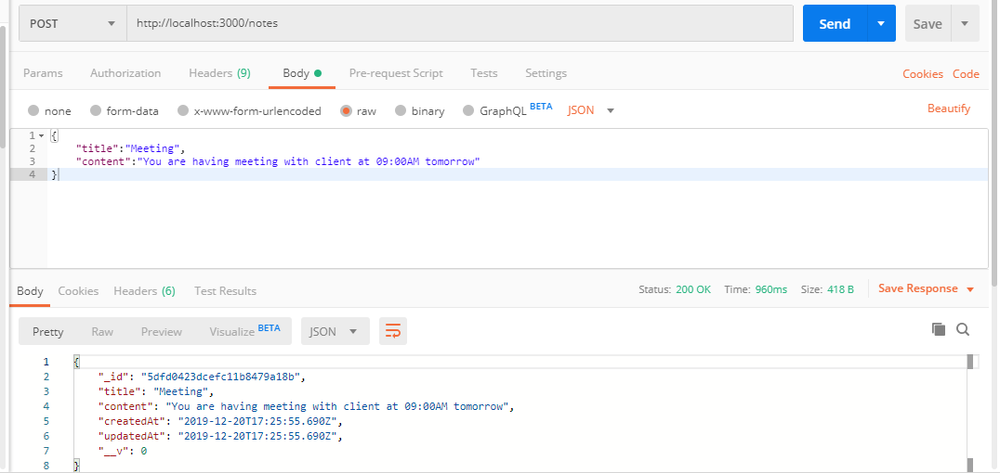
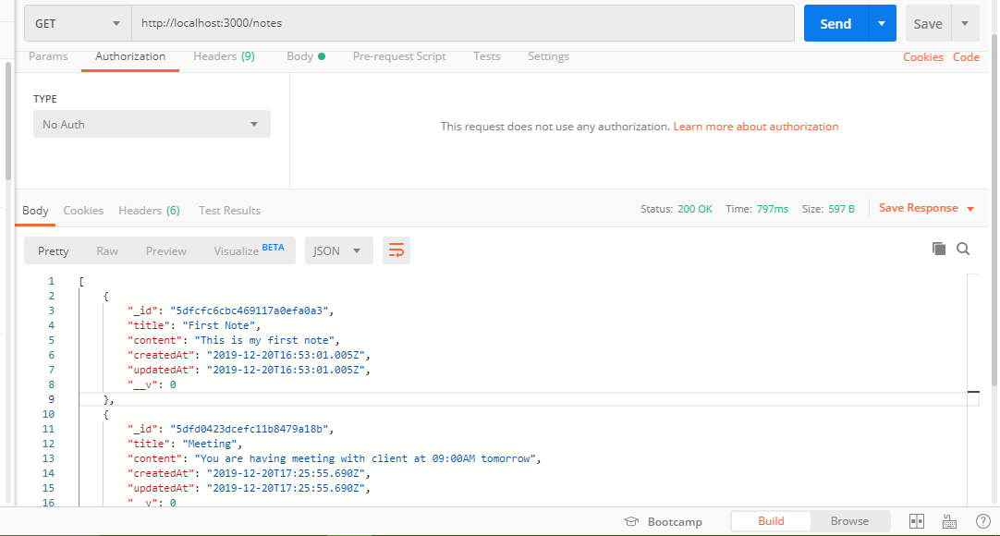
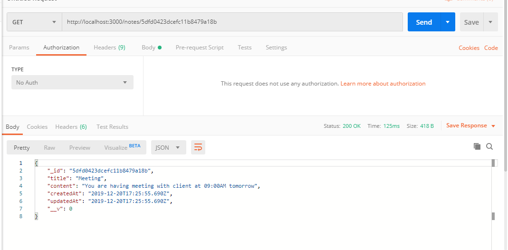
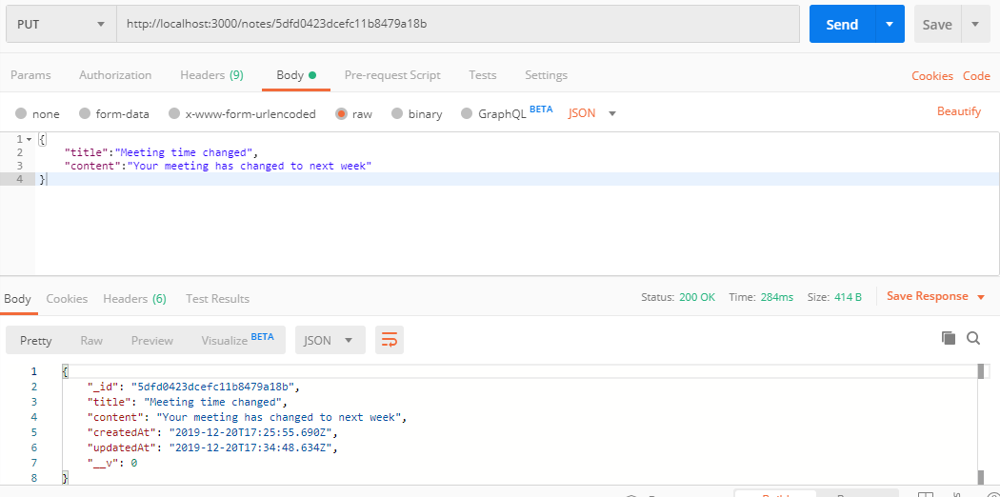
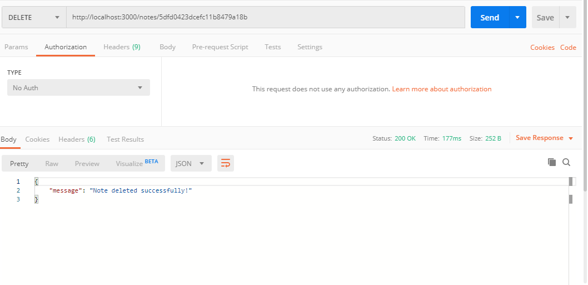

# REST API Note taking Application

Build a Restful CRUD API for a Note taking application using Node.js, Express and MongoDB.


### Testing our APIs
Let's now test all the APIs one by one using postman.

### Creating a new Note using POST /notes API



### Retrieving all Notes using GET /notes API


### Retrieving a single Note using GET /notes/:noteId API


### Updating a Note using PUT /notes/:noteId API



### Deleting a Note using DELETE /notes/:noteId API


## Steps to Setup
1. Install dependencies

```bash
npm install
```

2. Run Server

```bash
node server.js
```
You can browse the apis at <http://localhost:3000>

